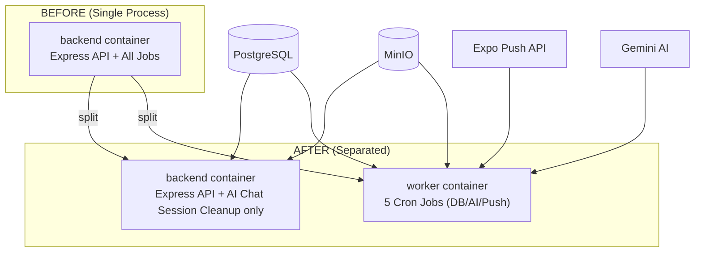

# Separate Background Jobs into a Dedicated Worker Service

## Background

Currently, the single `backend` container runs **both** the Express HTTP API server **and** all background/cron jobs in the same Node.js process ([index.ts](file:///Users/bewgade/Uni-work/4th-year/capstone-project/CP25OR1-PROJECT/backend/src/index.ts)). This means:

- Heavy AI batch processing (AI Tips, Health Insights) runs on the same event loop as API requests
- CPU/memory spikes from cron jobs can degrade API response times
- If the backend crashes due to a job OOM, the entire API goes down
- Jobs cannot be scaled or restarted independently

### Current Background Jobs Inventory

| # | Job Name | File | Schedule | What It Does | Dependencies |
|---|----------|------|----------|-------------|-------------|
| 1 | **Reminder Overdue Checker** | [reminder-scheduler.ts](file:///Users/bewgade/Uni-work/4th-year/capstone-project/CP25OR1-PROJECT/backend/src/jobs/reminder-scheduler.ts) | `*/15 * * * *` (every 15 min) | Marks reminders as "overdue" when past due date | Prisma (DB) |
| 2 | **Notification Sender** | [notification-scheduler.ts](file:///Users/bewgade/Uni-work/4th-year/capstone-project/CP25OR1-PROJECT/backend/src/jobs/notification-scheduler.ts#L8-L22) | `*/15 * * * *` (every 15 min) | Finds due reminders, sends push notifications to owner + caregivers | Prisma (DB), Expo Push API |
| 3 | **AI Tips Generator** | [notification-scheduler.ts](file:///Users/bewgade/Uni-work/4th-year/capstone-project/CP25OR1-PROJECT/backend/src/jobs/notification-scheduler.ts#L28-L44) | `0 5 * * *` (noon Bangkok) | Generates personalized pet tips via Gemini AI, sends push notifications | Prisma (DB), Gemini AI (LangChain), Expo Push API |
| 4 | **Health Insights Analyzer** | [notification-scheduler.ts](file:///Users/bewgade/Uni-work/4th-year/capstone-project/CP25OR1-PROJECT/backend/src/jobs/notification-scheduler.ts#L50-L66) | `0 12 * * *` (7 PM Bangkok) | Analyzes health logs for patterns across all pets, sends AI-generated insights | Prisma (DB), Gemini AI (LangChain), Expo Push API |
| 5 | **Pet Cleanup (Hard Delete)** | [pet-cleanup-scheduler.ts](file:///Users/bewgade/Uni-work/4th-year/capstone-project/CP25OR1-PROJECT/backend/src/jobs/pet-cleanup-scheduler.ts) | `0 0 * * *` (midnight UTC) | Hard-deletes soft-deleted pets older than 30 days + MinIO file cleanup | Prisma (DB), MinIO |
| 6 | **AI Chat Session Cleanup** | [ai-chat-session-manager.ts](file:///Users/bewgade/Uni-work/4th-year/capstone-project/CP25OR1-PROJECT/backend/src/features/ai-chat/ai-chat-session-manager.ts#L184-L189) | `setInterval` every 5 min | Evicts stale in-memory Gemini chat sessions (30 min TTL) | **In-memory Map** (process-local) |

## User Review Required

> [!IMPORTANT]
> **Job #6 (AI Chat Session Cleanup) MUST stay in the API server.** It cleans up an in-memory `Map<string, SessionEntry>` that holds active Gemini `Chat` objects. These sessions are created and used by incoming API requests. Moving this cleanup to a separate process would mean the worker has no access to the API's memory — it simply cannot work from another process. This is the correct architectural decision.

> [!WARNING]
> **Docker infrastructure change:** This plan adds a `worker` container to your docker-compose. Your production setup will go from **4 containers** (proxy, backend, minio, database) to **5 containers** (proxy, backend, **worker**, minio, database). The worker reuses the **exact same Docker image** as the backend — only the entrypoint command changes. No additional Dockerfile is needed.

## Proposed Changes

### Architecture Overview



Jobs 1–5 move to the **worker**. Job 6 stays in the **backend** (in-memory only).

---

### Component 1: Worker Entrypoint

#### [NEW] [worker.ts](file:///Users/bewgade/Uni-work/4th-year/capstone-project/CP25OR1-PROJECT/backend/src/worker.ts)

A new entrypoint file that starts **only** the background jobs without the Express server.

```typescript
// src/worker.ts
import { logger } from './libs/logger';
import { minioClient } from './libs/minio-client';
import { startSchedulers as startReminderScheduler } from './jobs/reminder-scheduler';
import { startNotificationScheduler } from './jobs/notification-scheduler';
import { startPetCleanupScheduler } from './jobs/pet-cleanup-scheduler';

// Initialize MinIO (needed for pet cleanup job to delete files)
minioClient.initialize()
  .then(() => logger.info('[Worker] MinIO connected successfully'))
  .catch((error) => logger.warn('[Worker] MinIO init failed:', error as Error));

logger.info('========================================');
logger.info('🔧 WORKER PROCESS STARTING');
logger.info('========================================');

// Start all cron jobs
startReminderScheduler();
startNotificationScheduler();
startPetCleanupScheduler();

logger.info('========================================');
logger.info('✅ WORKER PROCESS READY - All schedulers running');
logger.info('========================================');
```

Key points:
- Does NOT import `app.ts` or start Express
- Does NOT listen on any port
- Does NOT start AI Chat Session Cleanup (that stays in the API)
- Initializes MinIO (needed by pet cleanup job to delete profile images)
- Shares the exact same Prisma DB connection, config, logger, and services

---

### Component 2: API Server Cleanup

#### [MODIFY] [index.ts](file:///Users/bewgade/Uni-work/4th-year/capstone-project/CP25OR1-PROJECT/backend/src/index.ts)

Remove the 3 job scheduler imports and calls, keep only AI Chat Session Cleanup.

```diff
 import app from './app';
 import { logger } from './libs/logger';
 import { minioClient } from './libs/minio-client';
-import { startSchedulers as startReminderScheduler } from './jobs/reminder-scheduler';
-import { startNotificationScheduler } from './jobs/notification-scheduler';
-import { startPetCleanupScheduler } from './jobs/pet-cleanup-scheduler';
 import { startCleanupTimer as startAIChatSessionCleanup } from './features/ai-chat/ai-chat-session-manager';

 const PORT = process.env.PORT || 3000;

 // Initialize MinIO (non-blocking: server starts even if MinIO is unavailable)
 minioClient.initialize()
   .then(() => {
     logger.info('MinIO connected successfully');
   })
   .catch((error) => {
     logger.warn('MinIO initialization failed - file upload features will not work:', error as Error);
   });

 app.listen(PORT, () => {
   logger.info(`Server running on port ${PORT}`);

-  // Start the background jobs
-  startReminderScheduler();
-  startNotificationScheduler();
-  startPetCleanupScheduler();
+  // AI Chat Session Cleanup stays here because it manages in-memory sessions
   startAIChatSessionCleanup();
 });
```

---

### Component 3: Build & Scripts

#### [MODIFY] [package.json](file:///Users/bewgade/Uni-work/4th-year/capstone-project/CP25OR1-PROJECT/backend/package.json)

Add scripts for running the worker:

```diff
 "scripts": {
   "start": "node dist/index.js",
+  "start:worker": "node dist/worker.js",
   "dev": "nodemon --watch src --ext ts --exec ts-node src/index.ts",
+  "dev:worker": "nodemon --watch src --ext ts --exec ts-node src/worker.ts",
   "build": "prisma generate && tsc",
   "test": "echo \"Error: no test specified\" && exit 1",
   "seed": "ts-node prisma/seed.ts",
   "postinstall": "prisma generate"
 },
```

- `npm run start:worker` — Production worker process
- `npm run dev:worker` — Development worker with hot reload

---

### Component 4: Docker Infrastructure

#### [MODIFY] [docker-compose.yml](file:///Users/bewgade/Uni-work/4th-year/capstone-project/CP25OR1-PROJECT/backend/docker-compose.yml)

Add the `worker` service using the same image:

```diff
 services:
   backend:
     build:
       context: .
       args:
         DATABASE_URL: ${DATABASE_URL}
     container_name: backend
     env_file:
       - .env
     expose:
       - "3000"
     restart: unless-stopped
     networks:
       - app_net
     depends_on:
       - minio

+  worker:
+    build:
+      context: .
+      args:
+        DATABASE_URL: ${DATABASE_URL}
+    container_name: worker
+    env_file:
+      - .env
+    command: ["node", "dist/worker.js"]
+    restart: unless-stopped
+    networks:
+      - app_net
+    depends_on:
+      - minio
+
   minio:
     image: minio/minio:latest
```

Key points:
- **Same image** as backend — `build` reuses the same Dockerfile context (Docker build cache makes this nearly free)
- **`command` override** — Runs `dist/worker.js` instead of the default `dist/index.js`
- **No `expose`/`ports`** — The worker doesn't serve HTTP, so no port mapping needed
- **Same `env_file`** — Shares all environment variables (DATABASE_URL, GOOGLE_API_KEY, MINIO_*, etc.)
- **Same `networks`** — Can reach MinIO and the database on `app_net`
- **`depends_on: minio`** — Pet cleanup job needs MinIO access

#### [NO CHANGE] [Dockerfile](file:///Users/bewgade/Uni-work/4th-year/capstone-project/CP25OR1-PROJECT/backend/Dockerfile)

No changes needed. The existing Dockerfile already compiles all TypeScript files in `src/` (including the new `worker.ts`). The `CMD` default is `node dist/index.js` (for the API), and the worker overrides this via `command` in docker-compose.

---

### Component 5: Local Development

#### [MODIFY] [docker-compose.local.yml](file:///Users/bewgade/Uni-work/4th-year/capstone-project/CP25OR1-PROJECT/backend/docker-compose.local.yml)

No changes needed here — this file only runs MinIO for local dev. When developing locally, you run:
- Terminal 1: `npm run dev` (API server)
- Terminal 2: `npm run dev:worker` (Worker process)

---

## What Stays Exactly the Same

| Component | Why |
|-----------|-----|
| All job source files (`reminder-scheduler.ts`, `notification-scheduler.ts`, `pet-cleanup-scheduler.ts`) | Zero code changes — they already export clean `start*` functions |
| All service files (`ai-tips-generation-service.ts`, `health-insight-orchestrator.ts`, `notification-service.ts`, etc.) | Jobs call these via direct imports — no API calls needed |
| Prisma DB connection (`libs/db.ts`) | Worker uses the same DB connection string via env vars |
| Expo Push Service (`services/expo-push-service.ts`) | Stateless HTTP client — works from any process |
| MinIO client (`libs/minio-client.ts`) | Stateless client — initialized the same way in worker |
| AI Chat Session Manager (`ai-chat-session-manager.ts`) | Remains 100% in the API server (in-memory sessions are process-local) |
| Dockerfile | No changes needed — `tsc` already compiles everything |
| Proxy/Nginx configuration | Only routes to `backend:3000` — unaffected by worker |

## Summary of All File Changes

| File | Action | Lines Changed |
|------|--------|---------------|
| `src/worker.ts` | **NEW** | ~25 lines |
| `src/index.ts` | **MODIFY** | Remove 7 lines (3 imports + 4 job starts) |
| `package.json` | **MODIFY** | Add 2 script entries |
| `docker-compose.yml` | **MODIFY** | Add ~15 lines (worker service) |

**Total changes: ~50 lines across 4 files.** No service logic is modified. No breaking changes.

## Verification Plan

### Automated Tests
1. **Build verification**: `npm run build` — Ensures `worker.ts` compiles and `dist/worker.js` is emitted
2. **API server starts clean**: `npm run dev` — Verify only AI Chat Session Cleanup starts (no cron job logs)
3. **Worker starts clean**: `npm run dev:worker` — Verify all 5 cron schedulers start (check startup logs for the `========` banners)
4. **No double-execution**: Run both processes simultaneously and verify jobs only run once (check logs for duplicate "Running job:" entries)

### Manual Verification
1. **Docker compose build**: `docker compose build` — Ensures single image builds correctly
2. **Docker compose up**: `docker compose up -d` — Verify both `backend` and `worker` containers start
3. **Container logs**: 
   - `docker logs backend` — Should show "Server running on port 3000" + AI Chat Session Cleanup only
   - `docker logs worker` — Should show all 5 scheduler startup banners
4. **API health check**: Hit any API endpoint to confirm the backend still responds normally
5. **Job execution**: Wait for a 15-minute cycle and verify reminder/notification jobs run in the worker container
